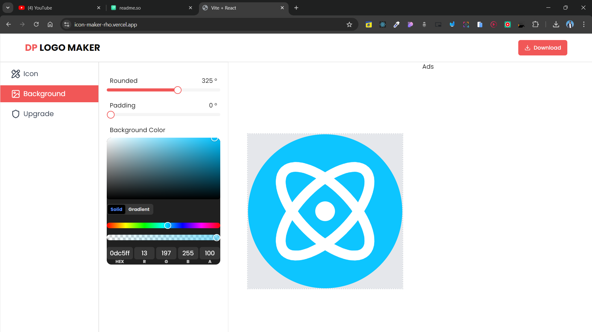
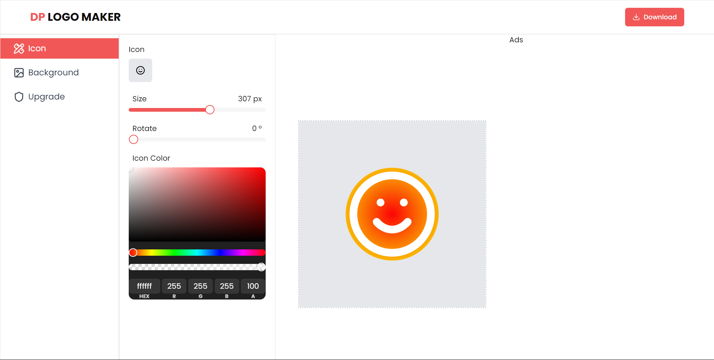

# ICON MAKER REACT APP

## Lessons Learned

This was a challenging project where i learned a lot of new concepts in react used context api in depth and tried using some new npm tools like color picker tool & html2canvas tool. At the end i deployed my first app in vercel which seemed difficult to use but it was actually a seemless experience and i deployed my first app in few seconds.

 

This has functionalities like :-
 

<ul>
<li>changing the icon image, it's color, size or rotation of the icon.</li> 
<li>changing the roundness, padding and background color</li>  
<li>downloading the icon at the end </li>
<ul>

## Tech Stack

<ul>
<li>React Js and Vite</li>
<li>vercel for deployment</li>
<li>npm for tools like color picker and html2canvas</li>
</ul>

## Screenshots

## Reference

tubeguruji youtube channel
